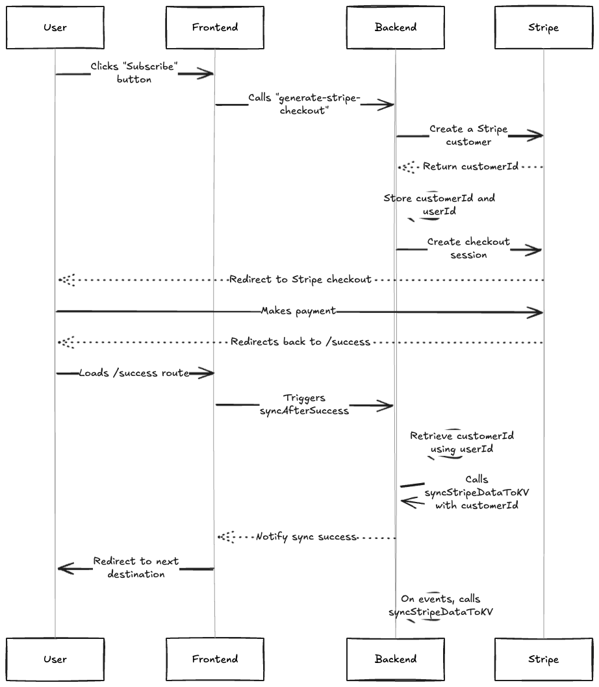

[](https://github.com/argcast/paykit/actions/workflows/build-nextjs.yml)

# Paykit
A plug-and-play Stripe integration kit for modern JavaScript frameworks — starting with **Next.js**, and expanding to more frameworks in the future. This project is inspired by [Theo’s "How I Stay Sane Implementing Stripe"](https://github.com/t3dotgg/stripe-recommendations/tree/main), which lays out the clearest approach I’ve seen for managing the split-brain nature of Stripe data and your app state. Paykit builds on that idea to provide a fully installable, framework-ready implementation.

> 💡 **Quick Start**

```bash
npx paykit-cli@latest
```
The CLI will guide you through setting up a Stripe-connected project using Next.js. It includes:
- Full Stripe integration (checkout, webhooks, sync)
- KV store readiness
  


## Why this project exists

Stripe is powerful — but integrating it properly is often a painful mix of:

- Boilerplate code
- Unclear event flow
- Race conditions between webhooks and frontend state



## What Paykit does

- Creates and syncs Stripe customers with your user IDs
- Handles checkout session creation with the proper customer binding
- Provides a single `syncStripeDataToKV(customerId)` method to eliminate inconsistencies
- Responds to relevant Stripe webhook events
- Offers prebuilt route handlers and helpers tailored to each supported framework
- You should carefully read [things that are still your problem](https://github.com/t3dotgg/stripe-recommendations?tab=readme-ov-file#things-that-are-still-your-problem) even we preset most of them in your `env.local` file.

## What Paykit is *not*

Paykit is not a full-scale, all-in-one Stripe system for your entire SaaS or app.

It’s the minimal foundation you need to integrate Stripe safely and sanely — a starting point to get you up and running without wandering through Stripe’s documentation desert.  
Think of it as the groundwork that saves you hours of setup, so you can focus on building what makes your product unique.

## Supported Frameworks (Work in Progress)

| Framework | Status              | Demo                              |
|-----------|---------------------|-----------------------------------|
| Next.js   | ✅ In progress (MVP) | [Live Demo](https://paykit-nextjs.vercel.app) |
| Express   | 🟡 Planned           | –                                 |

## How To Contrubute & Project Roadmap

Got feedback or want to contribute? Feel free to [reach out to me on X](https://x.com/arcastrodev) or open an issue.

See [`ROADMAP.md`](https://github.com/argcast/paykit/tree/main/ROADMAP.md) for planned integrations and contributions.

## Credits & License

Inspired by Theo’s guide:  
[How I Stay Sane Implementing Stripe](https://github.com/t3dotgg/stripe-recommendations/tree/main)

I am not affiliated — just found it too good not to build into a reusable package.

MIT Licensed.
